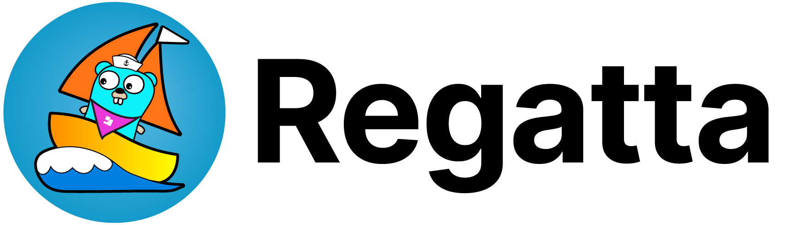

# Regatta

**Regatta** is a distributed, eventually consistent key-value store built for Kubernetes.
It is designed to distribute data globally in a *hub-and-spoke model* with an emphasis on *high read throughput*.
It is *fault-tolerant* and able to handle network partitions and node outages gracefully.

## Production readiness
* Even though Regatta has not yet reached the 1.0 milestone it is ready for a production use.
* There might be backward incompatible changes introduced until version 1.0, those will always be flagged in the release notes.
* Builds for tagged versions are provided in form of binaries in GH release, and Docker images.
* Tagged releases are suggested for production use, mainline builds should be used only for testing purposes.

## Why?

* You need to distribute data from a single cluster to multiple follower clusters in edge locations.
* You need a local, persistent, cache within a data center and reads heavily outnumber writes.
* You need a pseudo-document store.

## Documentation

For guidance on installation, deployment, and administration,
see the [documentation page](https://engineering.jamf.com/regatta).

## Contributing

Regatta is in active development and contributors are welcome! For guidance on development, see the page
[Contributing](https://engineering.jamf.com/regatta/contributing).
Feel free to ask questions and engage in [GitHub Discussions](https://github.com/jamf/regatta/discussions)!

