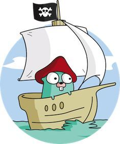

# Regatta


Regatta is a read-optimised distributed key-value store.

## Development environment prerequisites
* [Go](https://golang.org/) >= 1.15 -- `brew install go`
* Protocol Buffer compiler >= 3 -- `brew install protobuf`
* Go protobuf compiler -- `go install github.com/golang/protobuf/protoc-gen-go`
* Go gRPC gateway compiler plugin -- `go install github.com/grpc-ecosystem/grpc-gateway/protoc-gen-grpc-gateway`
* Go gRPC gateway swagger plugin  -- `go install github.com/grpc-ecosystem/grpc-gateway/protoc-gen-swagger`
* gRPC curl (optional for testing) -- `brew install grpcurl`
* [Docker](https://www.docker.com) (optional for testing)
* [kind](https://kind.sigs.k8s.io/) (optional for testing)

## Other links
* [gRPC in Golang](https://grpc.io/docs/languages/go/)
* [gRPC REST Gateway](https://github.com/grpc-ecosystem/grpc-gateway)
* [Protobuffers in JSON](https://developers.google.com/protocol-buffers/docs/proto3#json)
* [Dragonboat](https://github.com/lni/dragonboat)

## Usage
```
$ regatta --help
Regatta is read-optimized distributed key-value store.

Usage:
  regatta [flags]

Flags:
      --api.address string                    Address the API server should listen on. (default "localhost:8443")
      --api.cert-filename string              Path to the API server certificate. (default "hack/server.crt")
      --api.key-filename string               Path to the API server private key file. (default "hack/server.key")
      --api.reflection-api                    Whether reflection API is provided. Should not be turned on in production.
      --dev-mode                              Dev mode enabled (verbose logging, human-friendly log format).
  -h, --help                                  help for regatta
      --kafka.brokers strings                 Address of the Kafka broker. (default [localhost:9092])
      --kafka.client-cert-filename string     Kafka client certificate.
      --kafka.client-key-filename string      Kafka client key.
      --kafka.group-id string                 Kafka consumer group ID. (default "regatta-local")
      --kafka.server-cert-filename string     Kafka broker CA.
      --kafka.timeout duration                Kafka dialer timeout. (default 10s)
      --kafka.tls                             Enables Kafka broker TLS connection.
      --kafka.topics strings                  Kafka topics to read from.
      --log-level string                      Log level: DEBUG/INFO/WARN/ERROR. (default "DEBUG")
      --raft.address string                   RaftAddress is a hostname:port or IP:port address used by the Raft RPC module for exchanging Raft messages and snapshots.
                                              This is also the identifier for a Storage instance. RaftAddress should be set to the public address that can be accessed from remote Storage instances.
      --raft.cluster-id uint                  Raft Cluster ID is the unique value used to identify a Raft cluster. (default 1)
      --raft.initial-members stringToString   Raft cluster initial members defines a mapping of node IDs to their respective raft address.
                                              The node ID must be must be Integer >= 1. Example for the initial 3 node cluster setup on the localhost: "--raft.initial-members=1=127.0.0.1:5012,2=127.0.0.1:5013,3=127.0.0.1:5014". (default [])
      --raft.listen-address string            ListenAddress is a hostname:port or IP:port address used by the Raft RPC module to listen on for Raft message and snapshots.
                                              When the ListenAddress field is not set, The Raft RPC module listens on RaftAddress. If 0.0.0.0 is specified as the IP of the ListenAddress, Regatta listens to the specified port on all interfaces.
                                              When hostname or domain name is specified, it is locally resolved to IP addresses first and Regatta listens to all resolved IP addresses.
      --raft.node-host-dir string             NodeHostDir raft internal storage (default "/tmp/regatta/raft")
      --raft.node-id uint                     Raft Node ID is a non-zero value used to identify a node within a Raft cluster. (default 1)
      --raft.state-machine-dir string         StateMachineDir persistent storage for the state machine. Applicable only when in-memory-state-machine=false. (default "/tmp/regatta/state-machine")
      --raft.state-machine-wal-dir string     StateMachineWalDir persistent storage for the state machine. If empty all state machine data is stored in state-machine-dir. 
                                              Applicable only when in-memory-state-machine=false.
      --raft.wal-dir string                   WALDir is the directory used for storing the WAL of Raft entries. 
                                              It is recommended to use low latency storage such as NVME SSD with power loss protection to store such WAL data. 
                                              Leave WALDir to have zero value will have everything stored in NodeHostDir.
```

## Running regatta locally

### Single replica
The following command will run regatta locally in the single replica:
```bash
$ make run
```

### Kind
Following command will initiate [kind](https://kind.sigs.k8s.io/) cluster with 3 regatta replicas running on it.
```bash
$ make kind
```

### Testing locally with kafka
Run kafka locally using docker-compose:
```bash
$ cd hack/local-kafka
$ docker-compose up
Creating network "local-kafka_default" with the default driver
Creating volume "local-kafka_zookeeper_data" with local driver
Creating volume "local-kafka_kafka_data" with local driver
Creating local-kafka_zookeeper_1 ... done
Creating local-kafka_kafka_1     ... done
Attaching to local-kafka_zookeeper_1, local-kafka_kafka_1
zookeeper_1  | zookeeper 15:00:32.90 
zookeeper_1  | zookeeper 15:00:32.96 Welcome to the Bitnami zookeeper container
zookeeper_1  | zookeeper 15:00:32.96 Subscribe to project updates by watching https://github.com/bitnami/bitnami-docker-zookeeper
zookeeper_1  | zookeeper 15:00:32.96 Submit issues and feature requests at https://github.com/bitnami/bitnami-docker-zookeeper/issues
zookeeper_1  | zookeeper 15:00:32.96 
(...)
```
Create `regatta-test` kafka topic:
```bash
$ docker run --network host --rm bitnami/kafka  /opt/bitnami/kafka/bin/kafka-topics.sh --create --topic regatta-test --bootstrap-server 127.0.0.1:9092
 15:00:53.73 
 15:00:53.74 Welcome to the Bitnami kafka container
 15:00:53.74 Subscribe to project updates by watching https://github.com/bitnami/bitnami-docker-kafka
 15:00:53.74 Submit issues and feature requests at https://github.com/bitnami/bitnami-docker-kafka/issues
 15:00:53.75 

Created topic regatta-test.
```
Run regatta:
```bash
./regatta --dev-mode --api.reflection-api --raft.address=127.0.0.1:5012 --raft.initial-members='1=127.0.0.1:5012'  --kafka.group-id=regatta-test-local --kafka.topics=regatta-test
```
Produce message to kafka:
```bash
echo "key_1:val_1" | docker run --rm -i --network host edenhill/kafkacat:1.6.0 -K: -b localhost:9092 -t regatta-test
```
Read out from regatta:
```bash
$ grpcurl -insecure "-d={\"table\": \"$(echo -n "regatta-test" | base64)\", \"key\": \"$(echo -n "key_1" | base64)\"}" 127.0.0.1:8443 regatta.v1.KV/Range
{
  "header": {
    "clusterId": "1",
    "memberId": "1",
    "raftTerm": "5",
    "raftLeaderId": "1"
  },
  "kvs": [
    {
      "key": "a2V5XzE=",
      "value": "dmFsXzE="
    }
  ],
  "count": "1"
}

$ echo -n "dmFsXzE=" | base64 --decode   
val_1
```

## Communicating with regatta
### Example client binary
The example client is located in `client/main.go`. You can run it by invoking the following command:
```bash
$ make run-client
```

### grpcurl
[gRPCurl](https://github.com/fullstorydev/grpcurl) is universal gRPC client that can be used for testing. 
It has similar interface to cURL. Few examples how to use it with regatta:
```bash
$ grpcurl -insecure 127.0.0.1:8443 list

$ echo -n 'table_1' | base64
dGFibGVfMQ==

$ echo -n 'key_1' | base64
a2V5XzE=

$ grpcurl -insecure -d='{"table": "dGFibGVfMQ==", "key": "a2V5XzE="}' 127.0.0.1:8443 regatta.v1.KV/Range
{"kvs":[{"key":"a2V5XzE=","value":"dGFibGVfMXZhbHVlXzE="}],"count":"1"}
$ echo "dGFibGVfMXZhbHVlXzE=" | base64 -d
table_1value_1
```

### REST
It is also possible to communicate with regatta using REST API:
```bash

$ echo -n 'table_1' | base64
dGFibGVfMQ==

$ echo -n 'key_1' | base64
a2V5XzE=

$ curl -d'{"table": "dGFibGVfMQ==", "key": "a2V5XzE="}' -k https://localhost:8443/v1/kv/range
{"kvs":[{"key":"a2V5XzE=","value":"dGFibGVfMXZhbHVlXzE="}],"count":"1"}
$ echo "dGFibGVfMXZhbHVlXzE=" | base64 -d
table_1value_1

$ curl -d'{}' -k https://localhost:8443/v1/maintenance/reset
{}
```

## Reset cluster data
1. Downscale the regatta statefulset to 0 replicas manually\
`$ kubectl --context <cluster> --namespace regatta scale statefulset --replicas 0 regatta`
2. Delete persistent volume claims in the cluster:\
`$ kubectl --context <cluster> --namespace regatta delete persistentvolumeclaims data-regatta-0`\
`$ kubectl --context <cluster> --namespace regatta delete persistentvolumeclaims data-regatta-1`\
`$ kubectl --context <cluster> --namespace regatta delete persistentvolumeclaims data-regatta-2`
3. Reset kafka offset for given consumer group ID
   1. SSH to kafka node
   2. List the topics to which the group is subscribed (use noSSL port 8091)\
    `$ /opt/kafka/bin/kafka-consumer-groups --bootstrap-server 127.0.0.1:8091 --group <consumer_group_id> --describe`
   3. Reset all topics the consumer group subsribes to (run without `--execute` flag for dry run)\
    `$ /opt/kafka/bin/kafka-consumer-groups --bootstrap-server 127.0.0.1:8091 --group <consumer_group_id> --reset-offsets --all-topics --to-earliest --execute`
   4. Verify the offset was reset\
    `$ /opt/kafka/bin/kafka-consumer-groups --bootstrap-server 127.0.0.1:8091 --group <consumer_group_id> --describe`
4. Upscale the regatta statefulset to 3 replicas manually\
`$ kubectl --context <cluster> --namespace regatta scale statefulset --replicas 3 regatta`
