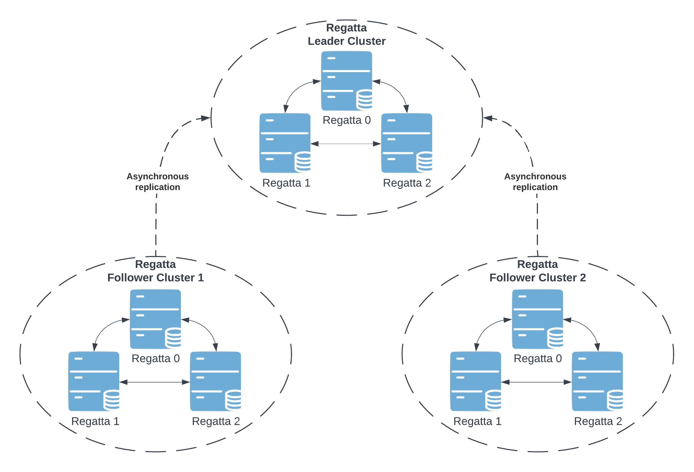
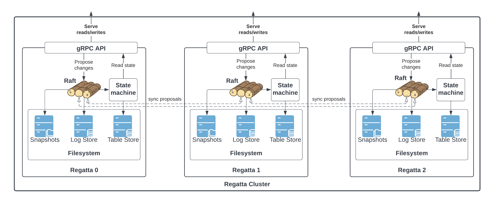

# Architecture

Regatta is designed as a "geographically distributed [etcd](https://etcd.io)", providing etcd-like gRPC API in every location
while maintaining a consistent data set. See [API](api) for the complete documentation of the gRPC API.

## Topology

The Regatta is designed as a
[hub-and-spoke](https://en.wikipedia.org/wiki/Spoke–hub_distribution_paradigm),
[consistent core system](https://martinfowler.com/articles/patterns-of-distributed-systems/consistent-core.html).
There is always a single statically defined leader cluster in the topology. Having a statically defined leader cluster
reduces operational costs and greatly simplifies the system due to fewer moving parts.

Regatta topology is designed as a multi-group Raft cluster within each data center with asynchronous
pull-based replication across locations. There are two types of clusters within Regatta multi-location deployment:
**Regatta leader cluster** and **Regatta follower cluster**.

* Regatta leader refers to a cluster accepting and confirming write proposals, sometimes referred to as a core cluster.
* Regatta follower refers to a cluster connected to the leader cluster asynchronously replicating its state locally,
  sometimes referred to as an edge cluster.

Thanks to this topology, the user can dynamically add additional follower clusters.

## Raft

Regatta uses [Raft protocol](https://raft.github.io) to ensure consistent data within the boundaries of a single cluster.
Raft is used only for data replication within a cluster. **Data replication from leader to follower clusters is
done via asynchronous polling**. That way Regatta can grant high write throughput within the
leader cluster without adding cross-location latency to each request.

The consensus algorithm provides fault-tolerance by allowing the system to operate as long as the majority of members
are available. This is not only useful for disaster scenarios but also enables the easy rolling update of the cluster.

## Tables

Regatta supports the notion of tables throughout its API. The tables could be imagined as sort of keyspaces or schemas.
*Each table is its own Raft group replicating within a single location, while also being a single replication unit for
cross-location replication*. That said, all the API guarantees regarding consistency are always scoped to a single table.
There is no guarantee of data consistency within multiple tables.

## APIs

Regatta exposes several gRPC APIs and a REST API:

* [Regatta gRPC API](api/#regatta-proto) is the user-facing API handling all read and write requests.
* [Replication gRPC API](api/#replication-proto) is enabled only in the leader cluster and is
  responsible for responding to the asynchronous replication requests from follower clusters. Raft log
  is replicated via this API from the leader cluster to follower clusters.
* [Maintenance gRPC API](api/#maintenance-proto) creates backups and restores from them.
* REST API exposes endpoints for [metrics and observability](operations_guide/metrics_and_observability).
