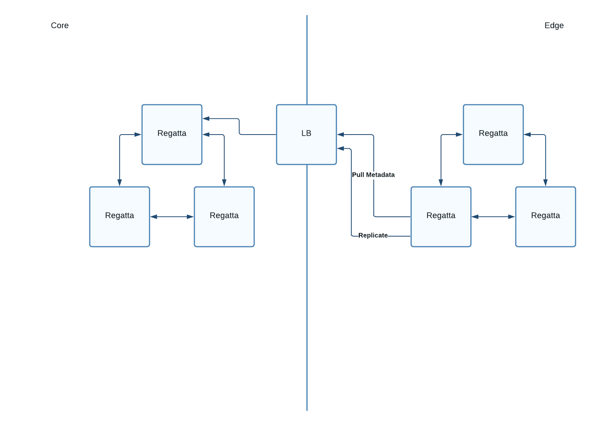
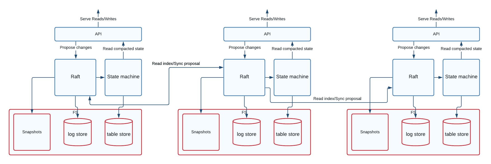

# Design

Regatta is modeled as "geo-distributed ETCD", providing ETCD-like API in every location while maintaining a consistent
data set.  
During the design and implementation we made several trade-offs that differentiate Regatta from its counterparts.

## Topology

The Regatta is designed as hub-and-spoke or consistent-core system. Within the topology there is always a single
statically defined leader cluster. Having a statically defined leader cluster reduces the operational costs and greatly
simplifies the system due to less moving parts.

Regatta topology is designed as a multi-group Raft cluster within each data center with asynchronous replication across
locations. There are two types of clusters within Regatta multi-location deployment.

> Regatta leader refers to cluster accepting and confirming Write proposals. (Sometimes referred as Core)

> Regatta follower refers to a cluster connected to the leader cluster asynchronously replicating its state locally. (Sometimes referred as Edge)

With topology like this the user is able to dynamically add additional follower clusters until leader cluster read
capacity is fully saturated.

## Raft

The Regatta uses Raft protocol to ensure consistent data within the boundaries of a single cluster. Raft is not used
across the locations, due to its synchronous nature. That way Regatta can grant high Write throughput within the Leader
cluster without adding cross-location latency to each request.

The consensus algorithm provides fault-tolerance by allowing the system to operate as long as the majority of members are available.
This is not only useful for disaster scenarios but also enables the easy rolling update of the cluster.

## Tables

The Regatta supports the notion of tables throughout its API. The tables could be imagined as sort of keyspaces or
schemas. Each table is its own Raft group replicating within a single location, while also being a single replication
unit for cross-location replication. That said, all the API guarantees regarding consistency are always scoped to a
single table. There is no guarantee of data consistency within multiple tables.
